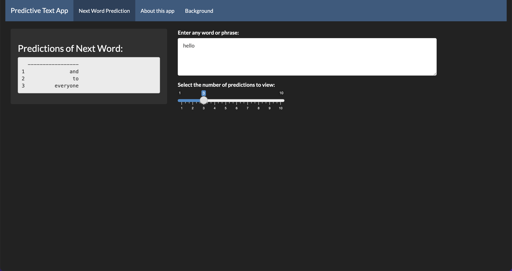

# nextword_mlprediction
This GitHub page contains the code for an interactive app that takes a text input and predicts the next word in the phrase.

This Shiny app was built as a part of the capstone project for the Johns Hopkins University Data Science Certification on Coursera.

## Shiny interface
The interactive Shiny app can be found via this [link](https://katiejchai.shinyapps.io/nextword_mlprediction/). A screenshot of the initial interface is shown below.

