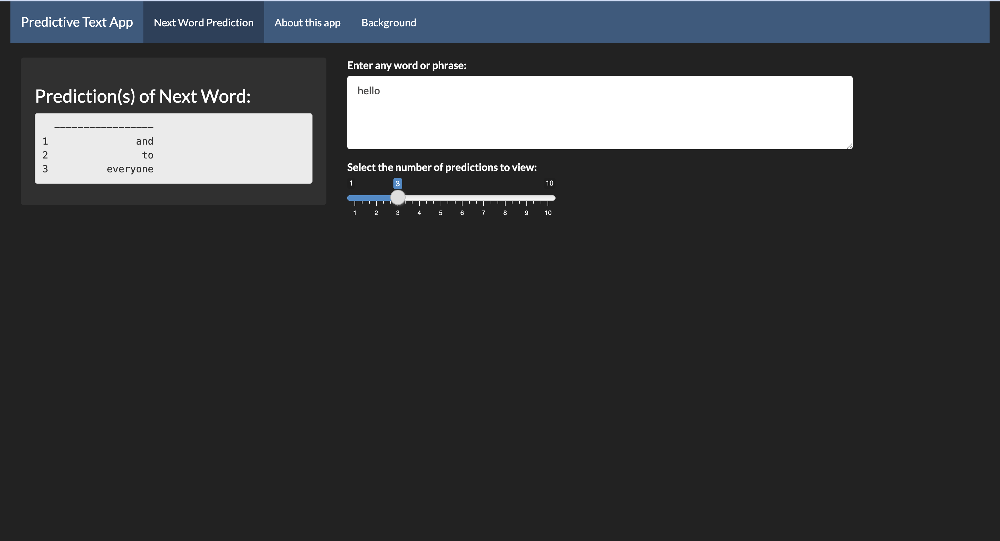

## Overview

The goal of the Johns Hopkins University Data Science Specialization Capstone Project was to develop a data product that takes an input of one or more words to predict the next word. The conceptual basis of this project was in the field of natural language processing, which investigates the interactions between computers and human language.


## Predictive Text Model Development

The prediction model was built based on n-grams of $n=1,2,3,4$. The n-grams were developed using English-based corpora from blog, news, and twitter data provided by SwiftKey. Because the provided data was so large in size, only a small sample of the total data was used: 8% of blogs, 20% of news, and 2% of twitter. This was done as a way to use more data that will likely be grammatically correct (ie. news), but also incorporate more natural, everyday language (ie. blogs and twitter).


## The Model

The final predictive text model is a form of a natural language processing backoff model, where the algorithm initially implements higher-order n-grams, then "backs off" to lower n-grams when there are no predictions based on the higher n-grams. This model is applied on the last words of the phrase (up to three). In the case where a multi-word phrase was entered but no quad-, tri-, or bi-gram-based predictions were available, the most common unigrams were used.

This type of model was chosen in an attempt to incorporate a large portion of input phrase's context and to utilize the most common phrases in the language.


## Data Product

<font size="4">
The final data product is a Shiny app that takes two inputs: a typed word or phrase, and a desired number of predictions. These two inputs are incorporated into the developed model to produce an output of words predicted to be next in the phrase. An image of the app interface is shown below.
</font>

<center>
```{r, out.width="80%", echo=FALSE}

```
</center>